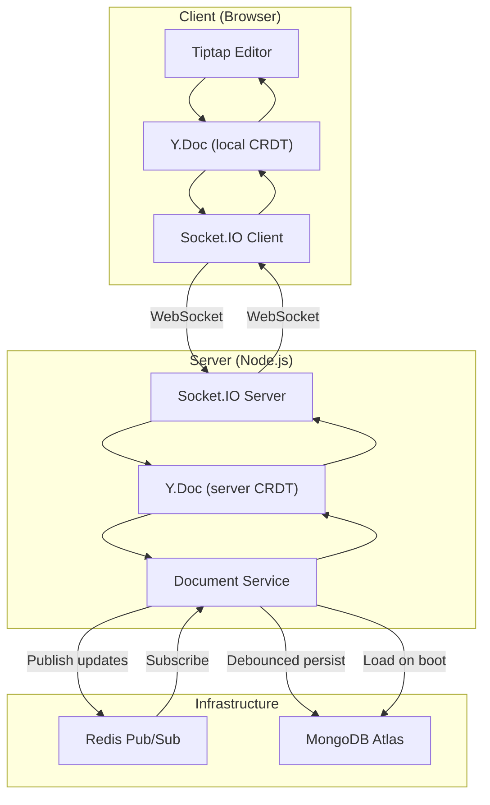
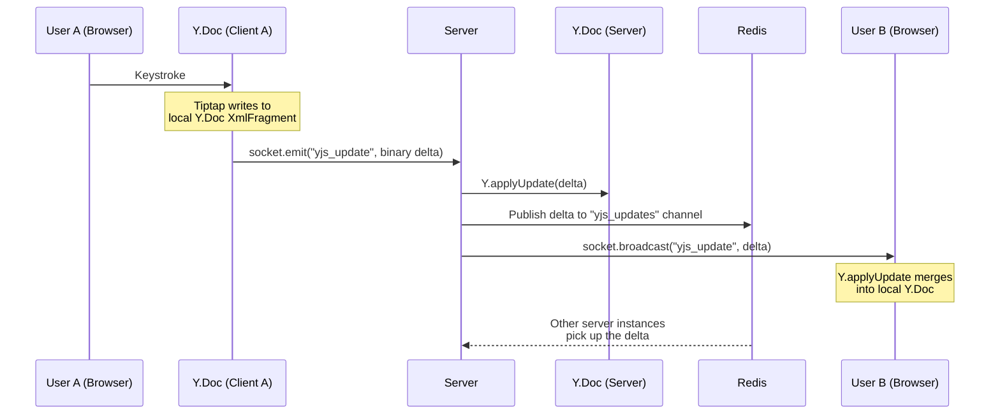
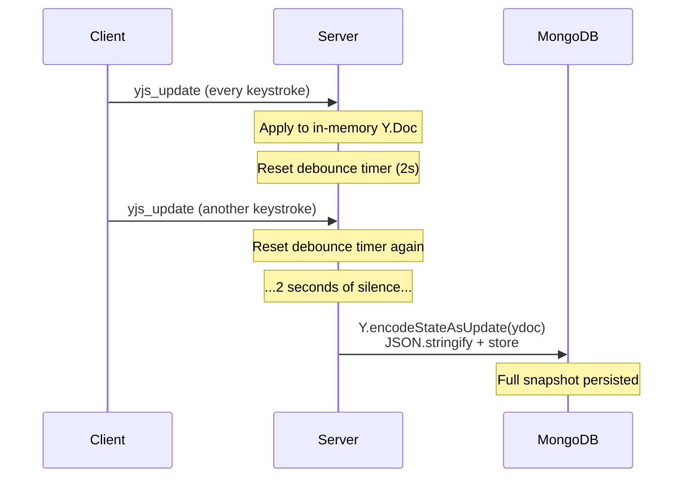
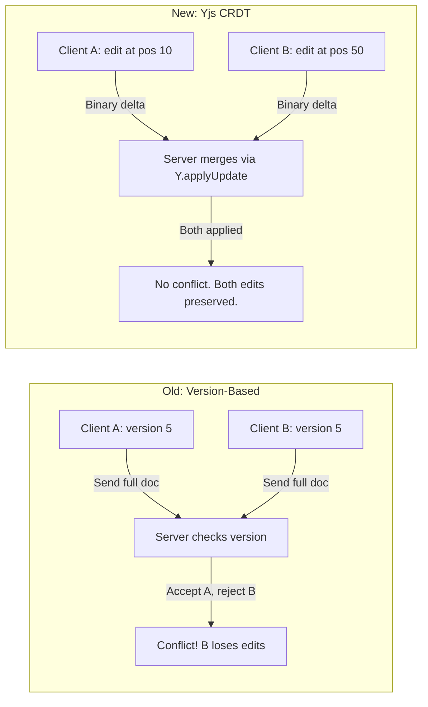
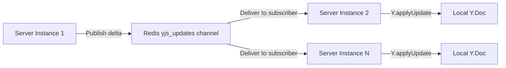

# Live Doc Editor

A real-time collaborative document editor where multiple users can type into the same document simultaneously, see each other's cursors, and never lose a keystroke. Built with Yjs CRDTs, Socket.IO, and a healthy amount of learning the hard way.

This started as a straightforward "build a collaborative editor" assessment and turned into a proper deep dive into conflict resolution, distributed state, and why Google Docs is harder than it looks.

## Demo

(https://github.com/user-attachments/assets/300dfb80-7bb0-48bb-9d24-7a32d3dd6f3c)

## Tech Stack

| Layer | Technology |
|---|---|
| Frontend | React 19, Tiptap v3 (ProseMirror), Yjs, Vite |
| Backend | Node.js, Express 5, Socket.IO |
| Realtime Sync | Yjs CRDT + Socket.IO WebSocket transport |
| Database | MongoDB Atlas (via Prisma ORM) |
| Pub/Sub | Redis (ioredis) |
| Validation | Zod |
| Logging | Pino + pino-pretty |
| Testing | Vitest, Supertest, socket.io-client |

## Setup Instructions

Assumes you have Node.js (v18+), npm, and Redis installed locally.

### 1. Clone the repo

```bash
git clone <repo-url>
cd <repo-name>
```

### 2. Install dependencies

```bash
cd client && npm install
cd ../server && npm install
```

### 3. Environment variables

The `.env` files are included in the repo for convenience (this is an assessment, not production).

**server/.env** needs:
```
DATABASE_URL="your-mongodb-connection-string"
```

**client/.env** should have:
```
VITE_API_URL=http://localhost:8080
```

### 4. Make sure Redis is running

```bash
redis-server
```

If you're on macOS with Homebrew: `brew services start redis`. Default port 6379.

### 5. Initialize the database

From the `server/` directory:

```bash
npx prisma db push
npx prisma generate
node prisma/seed.js
```

The seed script creates a single empty document in MongoDB. The server expects at least one document to exist on startup, so don't skip this.

### 6. Start the servers

In two separate terminals:

```bash
# Terminal 1 - Backend (port 8080)
cd server
npm run dev

# Terminal 2 - Frontend (Vite dev server)
cd client
npm run dev
```

### 7. Run tests

```bash
cd server
npm run test
```

Tests require Redis and MongoDB to be accessible.

## Architecture Deep Dive

### High-Level Overview

The system has four main pieces: a React frontend with Tiptap/Yjs handling the editor, a Node.js backend coordinating socket events, Redis for cross-instance communication, and MongoDB for persistence.



### Real-Time Update Flow

When a user types a character, here's what actually happens:



The key thing here: we only send the binary delta (the diff), not the full document. This keeps payloads small and sync fast.

### Persistence Flow

Real-time sync and persistence are deliberately decoupled:



## Evolution of the System

This project went through a significant architectural shift. Worth explaining because it shows why CRDTs exist.

### The Old Approach: Version-Based Conflict Resolution

The first version used a classic optimistic concurrency model:

- Every document had a `version` number
- Clients sent edits as `{ content: "full text", version: 5 }`
- Server checked: does your version match the current version?
  - Yes: accept the edit, increment version
  - No: reject with a conflict error

This is the same pattern you'd use for a REST API updating a database row. Turns out, it falls apart fast when two people are typing at the same time.

**Why it failed:**
- User A and User B both have version 5
- User A submits first, version becomes 6
- User B's edit (based on version 5) gets rejected
- User B's changes are lost, or they have to manually reconcile
- At typing speed, this happens constantly

The fundamental problem: you're sending the *entire document* on every edit and treating the whole thing as a single atomic value. There's no concept of "User A edited line 3 while User B edited line 7."

### The New Approach: Yjs CRDT

CRDTs (Conflict-free Replicated Data Types) solve this at the data structure level. Yjs specifically gives you:

- **Automatic merging**: Two users editing different parts of the doc? Merged without conflicts. Same word? Also merged, deterministically.
- **Binary deltas**: Instead of sending full content, each edit is a tiny binary update (usually a few dozen bytes)
- **Offline support (free)**: If a client goes offline and comes back, their queued updates merge cleanly
- **No server arbitration**: The server doesn't decide who "wins." The CRDT math handles it.



The migration meant ripping out the version checking logic, the content diffing, and the conflict error handling. Replaced it all with `Y.applyUpdate()` and a Tiptap Collaboration extension. Significantly less code, significantly fewer bugs.

> If you want to trace the evolution through the commit history, I can provide the specific commit references where the migration happened. Let me know if that would be useful.

## Autosave Strategy

Saving to the database on every keystroke is a terrible idea. At 60 WPM, that's roughly 5 DB writes per second per user. Multiply by concurrent users and you're burning through I/O for no reason.

The system splits this into two separate concerns:

**Real-time sync (instant, every keystroke):**
- User types -> Tiptap updates local Y.Doc -> `ydoc.on("update")` fires -> binary delta emitted via Socket.IO -> server applies it and broadcasts to peers
- This is sub-millisecond. No database involved.

**Persistence (debounced, every 2 seconds of silence):**
- When the server receives a `yjs_update`, it calls `schedulePersist()`
- `schedulePersist()` clears any existing timeout and sets a new 2-second timer
- If no new updates arrive within 2 seconds, it takes a full Yjs state snapshot and writes it to MongoDB
- If more updates come in, the timer resets

The result: users see each other's changes instantly, but the database only gets hit during natural pauses in typing. In practice, this means maybe one write every few seconds instead of one per character.

The 2-second window is configurable. Shorter means less potential data loss on crashes, longer means fewer DB writes. For an assessment project, 2 seconds felt like a reasonable balance.

## Handling Concurrent Edits

This is the hard problem in collaborative editing, and the reason most people don't build their own Google Docs.

The naive approach (send full text, last write wins) doesn't work because:
- Edits aren't atomic; they overlap in time
- Users are editing different parts of the same document
- Network latency means the server sees events in a different order than they happened

Yjs solves this with a specific CRDT algorithm based on the YATA (Yet Another Transformation Approach) paper. Each character gets a unique ID based on the client ID and a logical clock. When two clients insert at the same position, the IDs deterministically decide the order. No conflicts possible, by construction.

In this codebase:
- The client's Tiptap editor writes to a `Y.Doc` via the Collaboration extension
- Every mutation produces a binary update (a few bytes describing "insert 'a' after position X with ID Y")
- The server and other clients apply these updates with `Y.applyUpdate()`
- Yjs guarantees that applying the same set of updates in any order produces the same final document

The server's Y.Doc is the source of truth for new clients joining. When you connect, you get `Y.encodeStateAsUpdate(ydoc)`, which is the full state. After that, you only receive deltas.

## Redis Usage

Redis is handling pub/sub for broadcasting Yjs updates across server instances. The setup is straightforward: when a server applies a Yjs update, it publishes the binary delta to a `yjs_updates` channel. Other server instances subscribed to that channel pick it up and apply it to their own in-memory Y.Doc.

Each message includes an `instanceId` (process PID) so a server doesn't re-apply its own updates.



Right now Redis is only doing pub/sub, but I was exploring it during the build and there's more I want to do here. Tracking active users in a shared Redis Set so presence works across load-balanced instances, caching document snapshots to speed up cold starts, maybe even using Redis Streams for a more durable event log. The pub/sub foundation is there, extending it is mostly a matter of time.

## Limitations

Being honest about what this system doesn't handle well:

### Single-document bottleneck
The server statically initializes one global Y.Doc from the database on startup. There's no concept of `/doc/:id` routing or managing multiple documents. Every user who connects edits the same document. For an assessment this is fine, but a real product would need a document registry with lazy loading.

**What I'd do:** Implement URL-based routing (`/doc/:id`), manage an active cache of Y.Doc instances in memory, and hydrate them from the DB on demand with an LRU eviction policy.

### Fragmented presence state
The `activeUsers` Map lives in Node.js process memory. If you spin up two server instances behind a load balancer, each one has its own view of who's online. User A connected to Server 1 won't see User B connected to Server 2 in the presence bar.

**What I'd do:** Migrate presence tracking into a shared Redis Hash or Set. Each server publishes joins/leaves to Redis, and all instances subscribe to build a consistent global user list.

### Infinite DB growth
Every autosave persists `Y.encodeStateAsUpdate(ydoc)`, which is the full CRDT state including tombstones (deletion markers). Yjs never forgets that a character was deleted; it keeps the metadata around for merge correctness. Over time, a heavily edited document's persisted state grows without bound.

**What I'd do:** Switch to event-sourced persistence, saving incremental deltas instead of full snapshots. Run a background compaction job that periodically calls `Y.encodeStateAsUpdate()` on a clean merge of all deltas, producing a fresh baseline and clearing accumulated tombstones.

## Testing

Tests live in `server/tests/` and cover two layers:

### Document Service Tests (`document.service.test.js`)
- Verifies the Yjs document service initializes correctly
- Tests that updates can be applied and the state is retrievable
- Validates that concurrent updates from different users merge without errors
- Checks idempotency (applying the same update twice doesn't corrupt state)
- Confirms persistence: after an update, the DB actually has content

### Socket Integration Tests (`document.socket.test.js`)
- Spins up a real HTTP server with Socket.IO
- Connects two clients and verifies that updates from Client 1 reach Client 2
- Tests the `join_document` flow and confirms `document_state` is returned
- Validates presence tracking (joining emits `presence_update`)
- Tests the typing indicator relay between clients

Run them with:

```bash
cd server
npm run test
```

Tests run with `vitest --run --maxWorkers=1` (serial execution) because they share a database and Redis instance. Parallel test runs would step on each other.

## Project Structure

```
.
├── client/
│   ├── src/
│   │   ├── App.jsx              # Main app: socket wiring, state, Yjs setup
│   │   ├── socket.js            # Socket.IO client singleton
│   │   ├── styles.css           # All styles (dark theme, editor, cursors)
│   │   └── components/
│   │       ├── Editor.jsx       # Tiptap editor + cursor decoration plugin
│   │       ├── PresenceBar.jsx  # Online users + typing indicators
│   │       └── StatusBar.jsx    # Connection status, word count, save state
│   └── ...
├── server/
│   ├── server.js                # Entry point: boot Redis, Yjs, Socket.IO
│   ├── prisma/
│   │   ├── schema.prisma        # Document model (MongoDB)
│   │   └── seed.js              # Creates initial empty document
│   ├── src/
│   │   ├── app.js               # Express setup (CORS, Helmet, routes)
│   │   ├── config/
│   │   │   ├── prisma.js        # Prisma client singleton
│   │   │   └── redis.js         # Redis pub/sub client pair
│   │   ├── services/
│   │   │   └── document.service.js  # Yjs doc management, persistence
│   │   ├── sockets/
│   │   │   └── document.socket.js   # All socket event handlers
│   │   ├── controllers/         # REST endpoint (GET /api/document)
│   │   ├── routes/              # Express router
│   │   ├── middleware/          # Error handling, HTTP logging
│   │   ├── utils/               # AppError, async handlers, validation
│   │   └── validators/          # Zod schemas
│   └── tests/
│       ├── document.service.test.js  # Unit tests for Yjs service
│       └── document.socket.test.js   # Integration tests for socket flow
└── README.md
```

## Closing Note

Building this was a good reminder of why collaborative editing is a genuinely hard problem. The version-based approach seemed reasonable until two browser tabs proved otherwise. Migrating to CRDTs felt like cheating at first because Yjs just... handles it, but understanding *why* it works (unique IDs, logical clocks, deterministic ordering) made the whole thing click.

If I had more time, the first thing I'd tackle is multi-document support and Redis-backed presence. The architecture is set up for it; the pub/sub layer is already there. After that, probably cursor name labels that fade out after a few seconds of inactivity (right now they just sit there, which gets noisy with many users).

The biggest lesson was about the gap between "this works with one user" and "this works with two users typing at the same time." Most of the subtle bugs lived in that gap. Race conditions in socket event ordering, stale state after reconnection, editor flickering on initial load. None of them show up in a demo with one browser tab.

Built by Kshitij, from Solan, and boy it was fun to build, thank you for this assignment.
